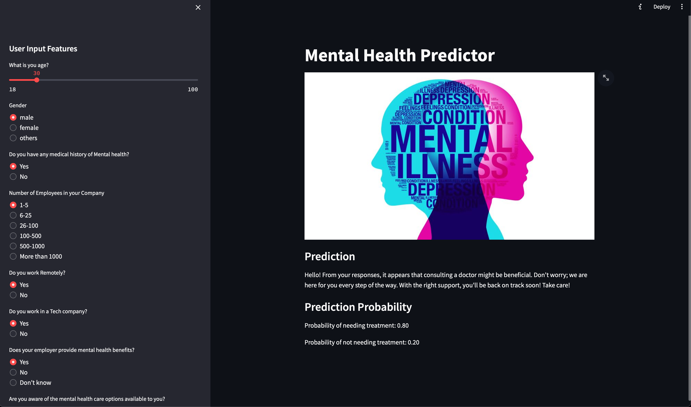

# Mental Health Predictor

The Mental Health Predictor project is an innovative solution designed to assess an individual's mental health based on a set of carefully crafted questions. In an era where mental health awareness is of paramount importance, this application aims to provide a quick and accessible tool for individuals to gauge their mental well-being.

## Key Features

1. **User-Friendly Interface:** The project offers an intuitive and user-friendly interface, allowing users to navigate through a series of questions related to their mental health.

2. **Machine Learning Model:** Behind the scenes, the project employs a robust machine learning model trained on diverse datasets(from kaggle) related to mental health. The model analyzes user responses and applies sophisticated algorithms to evaluate mental health indicators.


## Screenshots




## Run Locally

Clone the project

```bash
  git clone https://github.com/ShikharKunal/Mental_Health_Predictor
```

Go to the project directory

```bash
  cd Mental_Health_Predictor
```

Install dependencies

```bash
  pip install -r requirements.txt
```

Run the notebook

